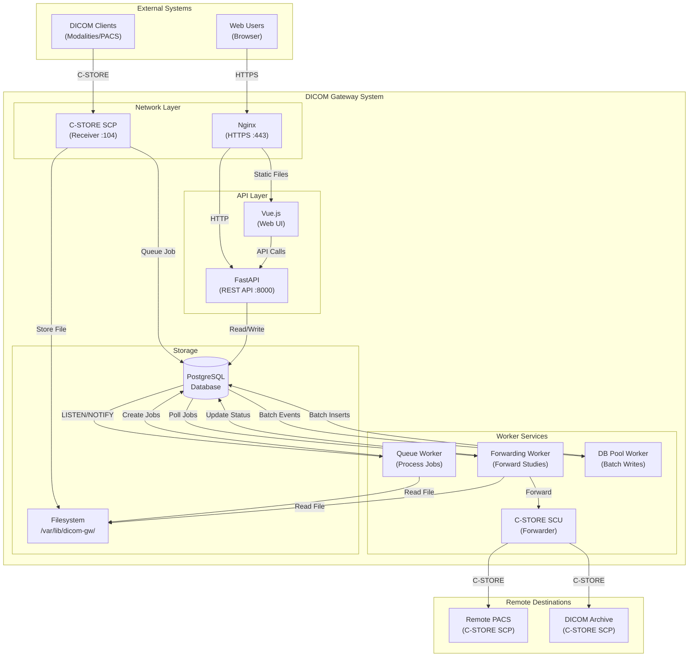
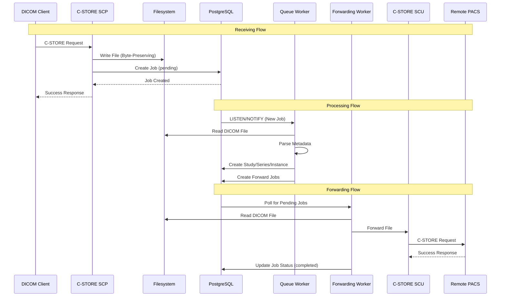
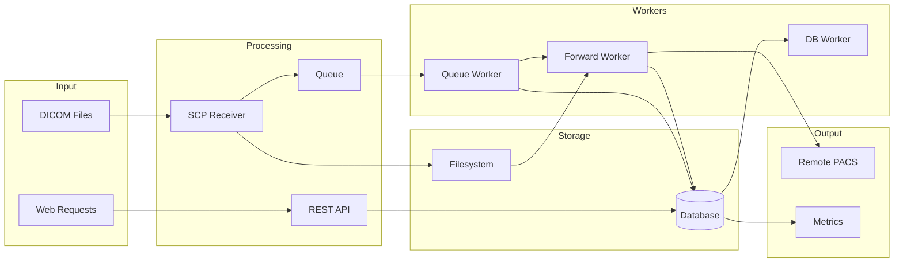
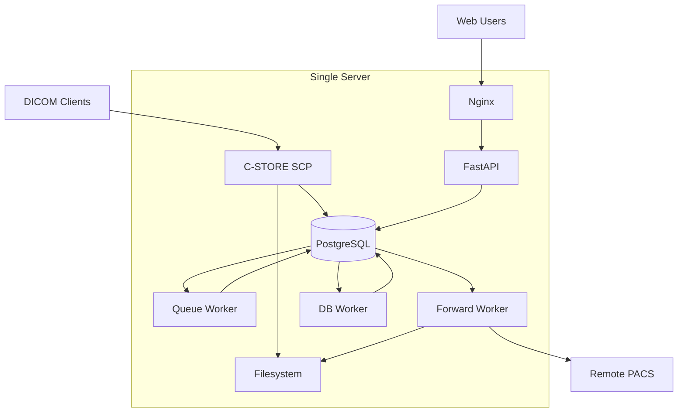
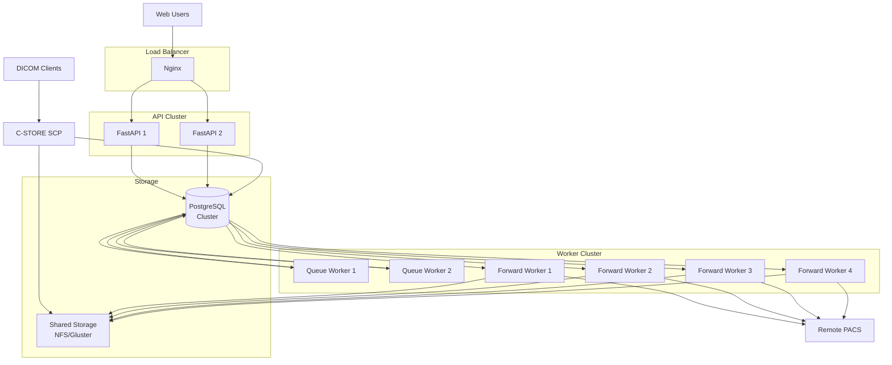

# Architecture Diagrams

This document contains visual architecture diagrams for the DICOM Gateway system.

## Viewing the Diagrams

### Mermaid Diagrams

The diagrams are written in Mermaid syntax and can be viewed in:

1. **GitHub/GitLab**: Automatically rendered in markdown files
2. **VS Code**: Install "Markdown Preview Mermaid Support" extension
3. **Online**: https://mermaid.live/
4. **CLI**: Install mermaid-cli: `npm install -g @mermaid-js/mermaid-cli`

### Rendering Locally

```bash
# Install mermaid-cli
npm install -g @mermaid-js/mermaid-cli

# Render to PNG
mmdc -i docs/architecture.mermaid -o docs/architecture.png

# Render to SVG
mmdc -i docs/architecture.mermaid -o docs/architecture.svg
```

## System Architecture



## Data Flow



## Component Interaction



## Deployment Scenarios

### Single Server Deployment



### Distributed Deployment



## Full Diagram Files

See the following files for complete diagram definitions:

- **System Architecture**: `docs/architecture.mermaid`
- **Data Flow**: `docs/data-flow.mermaid`

These can be rendered using Mermaid tools or viewed in any Mermaid-compatible viewer.

